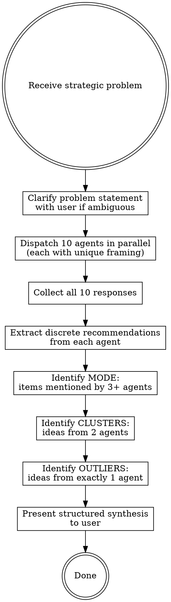

# Consensus Brainstormer

## Overview

**Stochastic Multi-Agent Consensus:** Spawn 10 independent agents with distinct cognitive framings to analyze a strategic problem. Synthesize results by identifying the **Mode** (convergent high-confidence recommendations) and **Outliers** (unique creative ideas from single agents).

The power is in the synthesis: convergence signals reliability, divergence signals creativity worth investigating.

## When to Use

- Strategic decisions with multiple viable paths
- Complex problems that benefit from diverse perspectives
- When you need both safe bets AND creative options
- Architecture decisions, product strategy, go-to-market planning
- Any problem where groupthink is a risk

**When NOT to use:** Simple factual questions, single-solution problems, tasks with clear correct answers.

## The 10 Framings

Each agent gets a distinct cognitive lens. All receive the same core problem but are primed with their framing:

| #   | Framing                      | Lens                                                            |
| --- | ---------------------------- | --------------------------------------------------------------- |
| 1   | **Contrarian**               | "What if the opposite is true? Challenge every assumption."     |
| 2   | **First-Principles Thinker** | "Strip away conventions. What are the fundamental truths?"      |
| 3   | **Traditionalist**           | "What proven approaches and established patterns apply?"        |
| 4   | **Optimist**                 | "What's the best-case scenario? What opportunities are hidden?" |
| 5   | **Risk Analyst**             | "What could go wrong? What are the hidden dangers?"             |
| 6   | **Systems Thinker**          | "What are the second-order effects and feedback loops?"         |
| 7   | **Customer Advocate**        | "What does the end user actually need and experience?"          |
| 8   | **Pragmatist**               | "What's actually buildable with current constraints?"           |
| 9   | **Disruptor**                | "What radical alternative would change the game entirely?"      |
| 10  | **Historian**                | "What historical parallels exist? What can we learn from them?" |

## Process



### Step 1: Clarify the Problem

Before dispatching agents, ensure you have a clear problem statement. If the user's prompt is ambiguous, ask ONE round of clarifying questions. Include:

- What specific decision or question needs answering?
- What constraints exist (time, budget, team, tech)?
- What has already been tried or ruled out?

### Step 2: Dispatch 10 Agents in Parallel

Use the Agent tool to spawn all 10 agents in a **single message** (parallel dispatch). Each agent gets:

**Prompt template:**

```
You are analyzing a strategic problem through a specific cognitive lens.

## Your Framing: [FRAMING_NAME]
[FRAMING_DESCRIPTION]

## Problem
[USER'S PROBLEM STATEMENT]

## Context
[ANY CONSTRAINTS OR BACKGROUND]

## Your Task
Analyze this problem through your [FRAMING_NAME] lens. Provide:

1. **Your Analysis** (2-3 paragraphs): How does this problem look through your lens?
2. **Top 3 Recommendations**: Numbered, actionable recommendations. Be specific.
3. **Key Insight**: One non-obvious insight unique to your perspective.
4. **Risk or Concern**: One thing others might miss.

Keep your total response under 400 words. Be concrete and actionable, not abstract.
Do NOT try to cover all perspectives — stay in your lane as the [FRAMING_NAME].
```

**Important:** Use `model: "sonnet"` for the 10 analysis agents to maximize speed and parallelism. Use the main conversation (Opus) for the synthesis.

### Step 3: Synthesize Results

After all 10 agents return, perform the following analysis yourself (do NOT delegate synthesis):

#### Extract Discrete Recommendations

From each agent's response, pull out every distinct recommendation or idea. Normalize language so similar ideas can be matched (e.g., "build an API" and "create a REST endpoint" = same idea).

#### Identify the MODE (High-Confidence Recommendations)

Items recommended by **3 or more agents** (out of 10). These represent convergent thinking — ideas that hold up across multiple cognitive lenses.

Present as:

```
## MODE: High-Confidence Recommendations
(Ideas endorsed by 3+ of 10 independent perspectives)

1. **[Recommendation]** — Endorsed by: [list framings], Confidence: [X/10]
   Summary of the convergent reasoning.

2. ...
```

#### Identify CLUSTERS (Moderate Signal)

Items recommended by **exactly 2 agents**. Worth considering but need more validation.

```
## CLUSTERS: Moderate-Confidence Ideas
(Ideas endorsed by exactly 2 perspectives)

- **[Idea]** — From: [Framing A] + [Framing B]
  Why these two lenses converged on this.
```

#### Identify OUTLIERS (Creative Exploration)

Items recommended by **exactly 1 agent**. These are the creative, non-obvious ideas that consensus methods usually kill. Preserve them explicitly.

```
## OUTLIERS: Unique Ideas Worth Exploring
(Ideas from exactly 1 perspective — don't dismiss these)

- **[Idea]** — From: [Framing]
  Why this perspective uniquely surfaced this idea.
  Potential value if correct: [brief assessment]
```

### Step 4: Present the Synthesis

Structure the final output as:

```markdown
# Consensus Analysis: [Problem Title]

**Agents dispatched:** 10 | **Consensus threshold:** 3+ agents

## MODE: High-Confidence Recommendations

[sorted by endorsement count, highest first]

## CLUSTERS: Moderate-Confidence Ideas

[2-agent agreement]

## OUTLIERS: Unique Ideas Worth Exploring

[single-agent ideas, with potential value noted]

## Tensions & Trade-offs

[Where agents directly contradicted each other — these reveal genuine trade-offs]

## Recommended Next Steps

[2-3 concrete actions based on the synthesis]
```

## Variations

Parse the user's prompt for these keywords to select the mode:

| Keyword in prompt                 | Mode     | Agents             | MODE threshold |
| --------------------------------- | -------- | ------------------ | -------------- |
| "quick", "fast", "lightweight"    | Quick    | 5                  | 2+             |
| _(default — no keyword)_          | Standard | 10                 | 3+             |
| "deep", "stress test", "thorough" | Deep     | 10 + 3 adversarial | 3+             |

### Quick Mode (5 agents)

For less critical decisions, use 5 framings: Contrarian, First-Principles, Pragmatist, Customer Advocate, Risk Analyst. Adjust MODE threshold to 2+.

### Deep Mode (10 agents + follow-up)

After initial synthesis, dispatch 3 adversarial follow-up agents to stress-test the top MODE recommendations. Each adversarial agent gets a single MODE recommendation and the prompt: "Find the fatal flaw. Why would this fail? What's the strongest argument against it?" If a recommendation survives, confidence increases. If it crumbles, flag it as fragile in the final output.

### Custom Framings

The user can substitute framings by naming them in their prompt (e.g., "add a Regulator perspective"). Good replacements for domain-specific problems:

- **Regulator** (compliance-heavy domains)
- **Investor** (funding/growth decisions)
- **Competitor** (competitive strategy)
- **Engineer** (technical feasibility)
- **Designer** (UX/usability focus)

## Best Practices (from research)

These practices are drawn from MindStudio's Stochastic Multi-Agent Consensus framework, the Council of AI pattern, and academic research on multi-agent debate.

### Genuine Diversity is Non-Negotiable

Without genuine diversity, running 10 agents gives you 10 near-identical outputs — higher cost, no quality gain. The framings table above creates **persona variation**, which is the most practical diversity lever. For even stronger diversity, combine persona variation with:

- **Prompt framing variation**: Vary how the problem is presented (neutral, devil's advocate, constraint-based, unconventional emphasis)
- **Temperature variation** (if available): Spread agents across a range (0.5 conservative to 1.1 exploratory) to sample more of the solution space

### Record Disagreement, Don't Silence It

Strong disagreement between agents signals genuine uncertainty or real trade-offs. The **Tensions & Trade-offs** section exists specifically for this — when the Contrarian and Traditionalist directly contradict each other, that's the most valuable signal in the analysis.

### Consensus Corrects Random Error, Not Systematic Bias

If all 10 agents share the same blind spot (e.g., none have domain expertise in the problem area), consensus won't fix it. When you suspect systematic bias, add a domain-specific custom framing or provide richer context in the problem statement.

### Use Cheaper Models for Proposers, Stronger for Synthesis

The 10 analysis agents are proposers — they benefit from speed and diversity more than raw reasoning power. The synthesis step (identifying Mode/Clusters/Outliers, resolving tensions) requires the strongest model to weigh evidence and make judgment calls.

### Diminishing Returns Past 10 Agents

Research indicates the majority of quality gain is captured by the first 5-10 agents. Start with 10 (the default), only go to 15+ for genuinely high-stakes decisions where maximum coverage justifies the cost.

### Stress-Test the Mode (Deep Mode)

After synthesis, the MODE recommendations feel safe but may be "safe" because they're generic. Deep Mode dispatches 3 adversarial follow-up agents — each assigned to break one top MODE recommendation. If a recommendation survives adversarial pressure, confidence increases significantly.

## Common Mistakes

| Mistake                          | Fix                                                             |
| -------------------------------- | --------------------------------------------------------------- |
| Dispatching agents sequentially  | Use a single message with all 10 Agent tool calls               |
| Letting one agent do synthesis   | Synthesis must happen in main conversation with full context    |
| Ignoring outliers                | Outliers are features, not noise — always present them          |
| Vague problem statements         | Clarify constraints before dispatching                          |
| Over-normalizing recommendations | Keep agent-specific language when ideas are genuinely different |
| Using Opus for all 10 agents     | Use Sonnet for analysis agents; reserve Opus for synthesis      |
| Treating consensus as truth      | Consensus corrects random error, not systematic bias            |
| Identical agent configs          | Without genuine diversity, N agents = N copies of the same idea |
