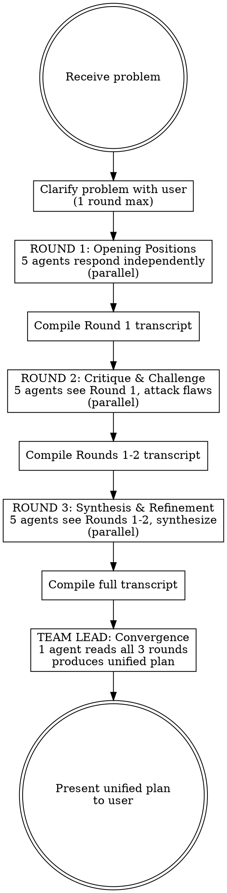

# Debate Chamber

## Overview

**Model-Chat Pattern:** Spawn 5 agents into a shared conversation room where they debate across 3 rounds, each round building on the previous. Agents see each other's prior responses and are instructed to find flaws, challenge assumptions, and synthesize stronger positions. A Team Lead agent then converges the full debate transcript into a single unified implementation plan.

Unlike consensus-brainstormer (parallel, independent agents), the debate chamber is **sequential and iterative** — ideas sharpen through friction.

## When to Use

- Problems where the first answer is rarely the best answer
- Implementation planning where trade-offs need to be argued through
- When you want ideas to collide and improve, not just be collected
- Architecture decisions, technical design, strategy refinement
- When consensus-brainstormer gives you a MODE but you want to stress-test it further

**When NOT to use:** Simple questions, time-sensitive decisions (3 rounds takes longer), factual lookups, tasks where independent perspectives are more valuable than iterative debate.

**Comparison with consensus-brainstormer:**

| Dimension         | Consensus Brainstormer              | Debate Chamber                          |
| ----------------- | ----------------------------------- | --------------------------------------- |
| Agent interaction | Independent, no cross-talk          | Iterative, agents respond to each other |
| Rounds            | 1 (parallel)                        | 3 sequential + convergence              |
| Strength          | Breadth of ideas, outlier discovery | Depth of analysis, idea refinement      |
| Speed             | Faster (1 parallel dispatch)        | Slower (3 sequential rounds)            |
| Best for          | "What are our options?"             | "Which option is best and why?"         |

## The 5 Debaters

Each agent has a distinct argumentative role designed to create productive tension:

| #   | Role              | Mandate                                                             | Style                       |
| --- | ----------------- | ------------------------------------------------------------------- | --------------------------- |
| 1   | **Architect**     | Big-picture design, system coherence, long-term implications        | Structured, principled      |
| 2   | **Skeptic**       | Find flaws, challenge assumptions, probe weak points                | Adversarial, rigorous       |
| 3   | **Pragmatist**    | Implementation feasibility, timelines, resource constraints         | Grounded, practical         |
| 4   | **Innovator**     | Creative alternatives, unconventional approaches, what-if scenarios | Bold, exploratory           |
| 5   | **User Champion** | End-user impact, usability, adoption, unintended consequences       | Empathetic, outcome-focused |

## Process



### Step 1: Clarify the Problem

Before launching the debate, ensure you have a well-defined problem. If ambiguous, ask ONE round of clarifying questions:

- What specific problem or decision needs to be resolved?
- What constraints exist (time, budget, team, tech stack)?
- What has already been tried or decided?
- What does success look like?

### Step 2: Round 1 — Opening Positions

Dispatch all 5 agents in a **single message** (parallel). Each agent gets:

**Round 1 prompt template:**

```
You are a debater in a structured argumentation chamber analyzing a problem.

## Your Role: [ROLE_NAME]
[ROLE_MANDATE]. Your style is [STYLE].

## Problem
[USER'S PROBLEM STATEMENT]

## Context
[ANY CONSTRAINTS OR BACKGROUND]

## Round 1 Instructions
This is the OPENING ROUND. Present your initial position on this problem.

1. **Your Position** (2-3 paragraphs): How do you see this problem through your [ROLE_NAME] lens? What matters most?
2. **Your Proposal**: A concrete, actionable recommendation. Be specific enough that someone could start implementing it.
3. **Your Strongest Argument**: The single most compelling reason your approach is right.
4. **Your Acknowledged Weakness**: One legitimate concern about your own proposal (intellectual honesty earns credibility in later rounds).

Keep your response under 400 words. Be direct and opinionated — bland consensus positions will be torn apart in Round 2.
```

**Use `model: "sonnet"` for all 5 debaters.** Reserve Opus for the Team Lead convergence.

After all 5 agents return, compile the **Round 1 Transcript** — a numbered document with each agent's full response, labeled by role.

### Step 3: Round 2 — Critique & Challenge

Dispatch all 5 agents again in a **single message** (parallel). Each agent now sees the full Round 1 transcript:

**Round 2 prompt template:**

```
You are a debater in Round 2 of a structured argumentation chamber.

## Your Role: [ROLE_NAME]
[ROLE_MANDATE]. Your style is [STYLE].

## Problem
[USER'S PROBLEM STATEMENT]

## Round 1 Transcript (all 5 debaters' opening positions)
[FULL ROUND 1 TRANSCRIPT]

## Round 2 Instructions
This is the CRITIQUE ROUND. You have read everyone's opening positions. Now:

1. **Attack the Weakest Proposal**: Identify the proposal with the most serious flaw. Name the role, quote their specific claim, and explain exactly why it fails. Be specific — "I disagree" is not a critique.
2. **Defend or Evolve Your Position**: Has another debater's argument changed your thinking? If so, say how. If not, strengthen your original position by addressing the most likely objection.
3. **Steal the Best Idea**: Identify the single strongest insight from ANY other debater (not yourself) and explain how it could be incorporated into your approach.
4. **Your Revised Proposal**: An updated recommendation that accounts for what you learned in Round 1.

Keep your response under 400 words. Engage directly with other debaters' arguments — reference them by role name.
```

After all 5 agents return, compile the **Round 2 Transcript** appended to Round 1.

### Step 4: Round 3 — Synthesis & Refinement

Dispatch all 5 agents again in a **single message** (parallel). Each agent now sees Rounds 1 and 2:

**Round 3 prompt template:**

```
You are a debater in Round 3 (FINAL ROUND) of a structured argumentation chamber.

## Your Role: [ROLE_NAME]
[ROLE_MANDATE]. Your style is [STYLE].

## Problem
[USER'S PROBLEM STATEMENT]

## Full Debate Transcript (Rounds 1 and 2)
[FULL TRANSCRIPT OF ROUNDS 1 AND 2]

## Round 3 Instructions
This is the FINAL ROUND. The debate is converging. Your job is synthesis, not new arguments.

1. **Where We Agree**: What has emerged as common ground across debaters? List the specific points of convergence.
2. **Remaining Tensions**: What genuine disagreements persist? For each, state both sides fairly and explain why the tension exists (it may be a real trade-off, not a resolvable disagreement).
3. **Your Final Recommendation**: Your best proposal, refined by two rounds of debate. This should be noticeably better than your Round 1 position — if it isn't, you weren't listening.
4. **Implementation Priority**: If only ONE thing from this debate gets implemented, what should it be and why?

Keep your response under 400 words. Focus on synthesis and clarity — the Team Lead will use this to build the final plan.
```

After all 5 agents return, compile the **Full Debate Transcript** (all 3 rounds).

### Step 5: Team Lead Convergence

Dispatch **1 agent** in the foreground (you need the result):

**Use `model: "opus"` for the Team Lead** — this is the highest-judgment step.

**Team Lead prompt:**

```
You are the Team Lead reviewing a complete 3-round debate between 5 expert debaters.

## Problem
[USER'S PROBLEM STATEMENT]

## Context
[ANY CONSTRAINTS OR BACKGROUND]

## Full Debate Transcript (3 Rounds, 5 Debaters)
[COMPLETE TRANSCRIPT]

## Your Task
Converge this debate into a single, unified implementation plan. You are not a 6th debater — you are the decision-maker.

Produce this exact structure:

# Implementation Plan: [Problem Title]

## Decision Summary
[2-3 sentences: what we're doing and why. This should be a DECISION, not a summary of the debate.]

## The Plan
[Numbered, actionable steps. Each step should include:]
1. **[Action]** — [What to do, who owns it, what "done" looks like]
   - Rationale: [Which debater(s) argued for this and why it won]
   - Risk: [Key risk identified during debate + mitigation]

## What We're NOT Doing (and Why)
[Ideas that were proposed but deliberately excluded. For each:]
- **[Excluded idea]** — Proposed by [Role]. Excluded because [specific reason from the debate].
  Revisit if: [condition under which this decision should be reconsidered]

## Open Questions
[Genuine uncertainties that the debate surfaced but couldn't resolve. These need real-world data, not more debate.]

## Debate Scorecard
[Rate each debater's contribution:]
| Role | Best Contribution | Biggest Blind Spot |
|---|---|---|
| Architect | [their strongest point] | [what they missed] |
| Skeptic | ... | ... |
| Pragmatist | ... | ... |
| Innovator | ... | ... |
| User Champion | ... | ... |
```

### Step 6: Present the Result

Display the Team Lead's unified implementation plan to the user. Then show the debate stats:

```
---
Debate complete.
├─ Debaters: 5 (Architect, Skeptic, Pragmatist, Innovator, User Champion)
├─ Rounds: 3 (Opening → Critique → Synthesis)
├─ Total agent calls: 16 (5 + 5 + 5 + 1 Team Lead)
├─ Model: Sonnet (debaters) + Opus (Team Lead)
└─ Transcript length: ~6,000 words
---
```

## Variations

Parse the user's prompt for these keywords to select the mode:

| Keyword in prompt  | Mode     | Rounds               | Debaters                                                   |
| ------------------ | -------- | -------------------- | ---------------------------------------------------------- |
| "quick", "fast"    | Quick    | 2 rounds + Team Lead | 3 debaters (Skeptic, Pragmatist, Innovator)                |
| _(default)_        | Standard | 3 rounds + Team Lead | 5 debaters                                                 |
| "deep", "extended" | Deep     | 4 rounds + Team Lead | 5 debaters (Round 4 = adversarial stress-test of the plan) |

### Quick Mode (2 rounds, 3 debaters)

Use 3 debaters: Skeptic, Pragmatist, Innovator. Skip Round 3 — go directly from Critique to Team Lead. Total: 7 agent calls.

### Deep Mode (4 rounds, 5 debaters)

Add a 4th round after synthesis where each debater receives the Team Lead's draft plan and tries to break it. The Team Lead then produces a revised final plan. Total: 22 agent calls.

### Custom Debaters

The user can substitute debater roles. Good alternatives:

- **Security Analyst** (security-sensitive systems)
- **Data Engineer** (data pipeline decisions)
- **DevOps** (deployment and infrastructure)
- **Product Manager** (business value and prioritization)
- **Regulator** (compliance-heavy domains)

## Best Practices (from research)

These practices are drawn from MindStudio's Agent Chat Rooms guide, ICLR multi-agent debate research, and academic papers on structured argumentation convergence.

### Round 1 Independence Prevents Herding

The most important structural decision: Round 1 agents must respond independently with NO visibility into each other's outputs. If agents see early responses, they anchor on them and the debate loses diversity. This skill enforces this by dispatching all 5 agents in parallel in Round 1.

### Summarize Between Rounds to Prevent Token Bloat

As transcripts grow across 3 rounds, later agents receive increasingly long contexts that degrade performance. Between rounds, consider compressing each agent's position to 2-3 bullet points for the next round's context. The full transcript is still available to the Team Lead for final synthesis.

### Convergence Detection (Optional Early Stopping)

After Round 2, check if agents have substantially converged. If 4+ of 5 debaters agree on the core recommendation, Round 3 adds little value — skip directly to Team Lead. This saves 5 agent calls when debate converges early. Use a lightweight check: read the Round 2 responses and assess whether positions are converging or still diverging.

### The Synthesizer Must Decide, Not Hedge

The #1 anti-pattern in multi-agent debate synthesis is vague hedging: "both sides have valid points." The Team Lead prompt explicitly requires a DECISION and a "What We're NOT Doing" section. If the Team Lead produces hedged output, the prompt has failed — it should be impossible to read the plan without knowing what was chosen and what was rejected.

### Debate Adds Value Only for Genuine Trade-offs

Research shows simple majority voting captures most performance gains for straightforward tasks. Iterative debate adds value primarily when: (1) the problem has high initial variance in possible solutions, (2) genuine trade-offs exist between approaches, and (3) the cost of being wrong justifies the ~16x single-query cost. Don't run a 3-round debate to decide whether to use TypeScript.

### Don't Treat Debate Consensus as Infallible

When all 5 debaters converge on the same position, it might mean the answer is obviously right — or it might mean all agents share the same blind spot. For high-stakes decisions, add a post-debate validation step: one final agent asked to find what ALL debaters missed.

## Common Mistakes

| Mistake                           | Fix                                                                                                                              |
| --------------------------------- | -------------------------------------------------------------------------------------------------------------------------------- |
| Agents not referencing each other | Round 2-3 prompts MUST include the full transcript and instruct agents to name other roles                                       |
| Team Lead just summarizes         | Team Lead must DECIDE, not summarize — the prompt explicitly requires decisions and exclusions                                   |
| Skipping "What We're NOT Doing"   | Excluded ideas are as valuable as included ones — they prevent scope creep                                                       |
| Bland Round 1 positions           | Instruct agents to be opinionated — bland positions produce bland debates                                                        |
| Identical positions across rounds | If an agent's Round 3 position is identical to Round 1, the debate failed — their prompt must require acknowledging what changed |
| Sending transcript piecemeal      | Each round's agents must see the COMPLETE prior transcript, not just the previous round                                          |
| Herding in Round 1                | Round 1 MUST be parallel with no cross-agent visibility — this is non-negotiable                                                 |
| Vague synthesis ("it depends")    | Explicitly prohibit hedging — require concrete recommendations even under uncertainty                                            |
| Running debate for simple tasks   | If a smart human wouldn't want a second opinion, don't run a debate                                                              |
